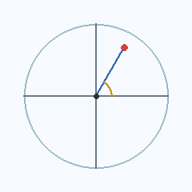
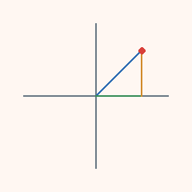
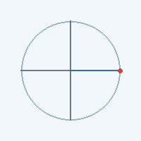

# Polar Coordinates in Polar Treasure

This document explains how we store and use polar coordinates (r, theta) in the app.
It is written for readers who are new to polar geometry.

## Quick mental model

- r (radius) is "how far from the center".
- theta (angle) is "how much you rotate from the right-hand direction".
- We store theta in radians (decimal values), because trig functions use radians.

If you stand at the center, you can describe any point by:
1. Turn by theta.
2. Walk forward r.

## Radians in 30 seconds

Radians measure angles by "how much arc length you walked on a circle".
For a circle of radius 1, the angle in radians equals the arc length.

Common values (decimal radians):
- 0.000 rad: pointing to the right
- 1.571 rad (pi / 2): straight up
- 3.142 rad (pi): pointing left
- 4.712 rad (3 * pi / 2): straight down
- 6.283 rad (2 * pi): full circle

Rule of thumb: 1 rad is about 57.3 deg.

## Visuals

Polar grid with a radius line and an angle arc.
Blue is r, orange is theta, red is the point.



The same point shown as a right triangle in x/y space.
Blue is r, green is x, orange is y, red is the point.



Angle sweeping around the circle (theta increasing).



## App coordinate system

The app uses a 2D screen coordinate system where x increases to the right and y increases
downward. For polar math we flip y so angles increase counterclockwise (up is positive).

We store:
- theta: radians in [0, 2*pi)
- r: "ring units" so it stays stable across canvas sizes
- radiusRatio: r normalized to [0, 1], used to map to pixels

### Mapping formulas (polar -> screen)

Definitions:
- ringCount = number of rings in the grid (currently 5)
- maxRadius = pixel radius of the grid
- radiusRatio = r / ringCount
- r_px = radiusRatio * maxRadius

Conversion:

```
x = origin.x + r_px * cos(theta)
y = origin.y - r_px * sin(theta)
```

The minus sign on y keeps "up" positive for math.

### Examples

Example A: straight up
- r = 2.5 rings
- theta = 1.571 rad (pi / 2)

radiusRatio = 2.5 / 5 = 0.5
r_px = 0.5 * maxRadius

x = origin.x
y = origin.y - r_px

Example B: up-right diagonal
- r = 4.0 rings
- theta = 0.785 rad (pi / 4)

radiusRatio = 4 / 5 = 0.8
r_px = 0.8 * maxRadius

x = origin.x + r_px * 0.707
y = origin.y - r_px * 0.707

## Stored excavation state

Each dig records a stable polar coordinate and a marker.

```
type ExcavationRecord = {
  angle: number;       // theta in radians
  radius: number;      // ring units (0..ringCount)
  radiusRatio: number; // 0..1, used for pixel mapping
};
```

Keeping theta in radians means we can plug it directly into cos/sin without converting.

## Why this helps future features

Because the stored data is normalized, you can:
- Resize the canvas without losing alignment.
- Plot rays (constant theta) or circles (constant r).
- Hide or show objects along a polar line by comparing theta values.
